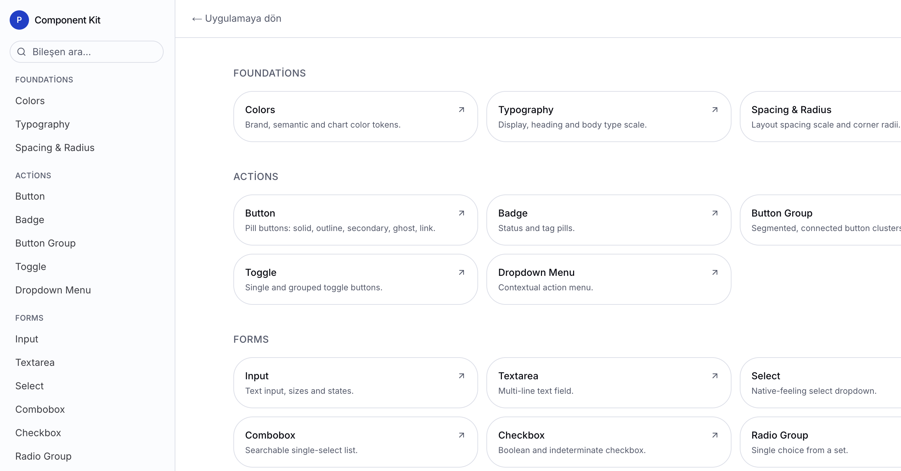

# MSCI Design Kit

A Next.js-based design system and component library built on top of [shadcn/ui](https://ui.shadcn.com), Radix primitives, and Tailwind CSS.



## Tech Stack

- [Next.js 16](https://nextjs.org) (App Router)
- [React 19](https://react.dev)
- [Tailwind CSS 4](https://tailwindcss.com)
- [shadcn/ui](https://ui.shadcn.com) + [Radix UI](https://www.radix-ui.com) primitives
- [TanStack Query](https://tanstack.com/query) / [Table](https://tanstack.com/table) / [Virtual](https://tanstack.com/virtual)
- [React Hook Form](https://react-hook-form.com) + [Zod](https://zod.dev)
- [Zustand](https://zustand-demo.pmnd.rs)

## Getting Started

This project uses [pnpm](https://pnpm.io) as its package manager.

```bash
pnpm install
pnpm dev
```

Open [http://localhost:3000](http://localhost:3000) with your browser to see the result.

## Scripts

| Command | Description |
| --- | --- |
| `pnpm dev` | Start the development server |
| `pnpm build` | Build for production |
| `pnpm start` | Start the production server |
| `pnpm lint` | Run ESLint |
| `pnpm typecheck` | Run TypeScript type checking |
| `pnpm format` | Format code with Prettier |
| `pnpm format:check` | Check formatting without writing changes |
| `pnpm analyze` | Analyze the production bundle |

## Project Structure

```
app/            # Next.js App Router pages, layouts, and providers
components/
  ui/           # Base UI primitives (shadcn/ui based)
  blocks/       # Composed, higher-level UI blocks
  dev/          # Internal development/preview components
lib/            # Shared utilities and the component dev registry
hooks/          # Shared React hooks
```

## Learn More

- [Next.js Documentation](https://nextjs.org/docs)
- [shadcn/ui Documentation](https://ui.shadcn.com/docs)
- [Tailwind CSS Documentation](https://tailwindcss.com/docs)
